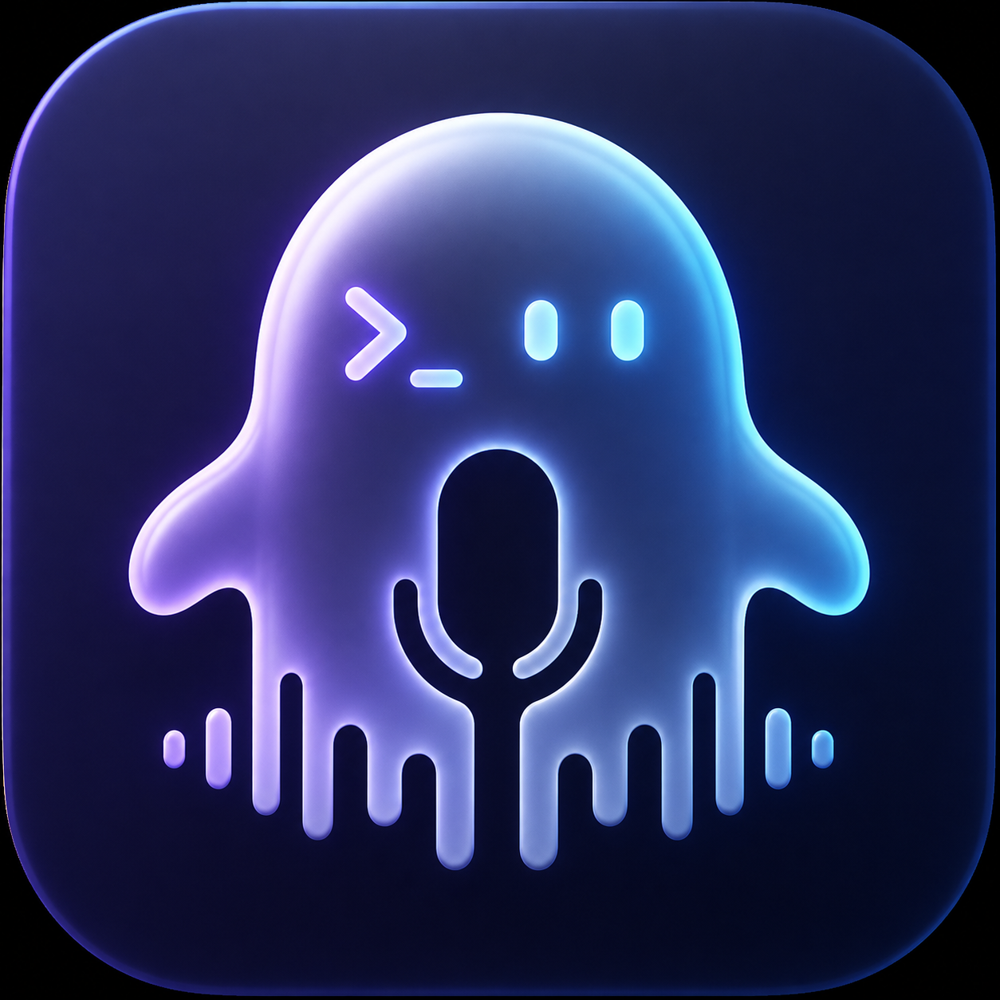
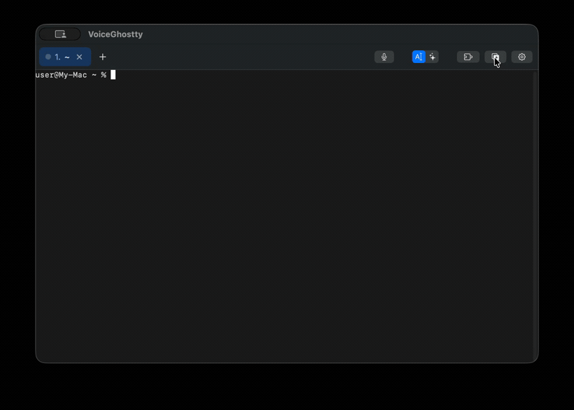

<div align="center">



# VoiceGhostty

**A voice-first terminal for Claude Code — hold space, talk, and your words land at the command line.**

Native macOS. Push-to-talk dictation, natural-language → command, tabs & splits, and one-click Claude Code *skill* loading.

[](https://github.com/10XTeams/VoiceGhostty/actions/workflows/release.yml)
[](https://github.com/10XTeams/VoiceGhostty/releases)
[](https://github.com/10XTeams/VoiceGhostty/stargazers)


[](LICENSE)

[**中文文档 →**](README.zh-CN.md)

</div>

---

<div align="center">



</div>

## Why

Working with [Claude Code](https://claude.com/claude-code) means a lot of "type a command, run it, read output, type again." VoiceGhostty keeps your hands off the keyboard for the *talking* parts:

- **Talk instead of type.** Hold <kbd>Space</kbd> to dictate straight into the shell prompt.
- **Say what you want, get the command.** Natural-language mode turns *"undo the last commit but keep the changes"* into `git reset --soft HEAD~1` — with a one-line explanation before you run it.
- **Never surprise-executes.** Recognized text is dropped at the cursor with newlines stripped. **You** press Enter. Always.
- **Load Claude Code skills on the fly.** A 🧩 panel syncs skills from your library into the current project's `.claude/skills/`, then fires `/reload-skills`.

## Features

| | |
|---|---|
| 🎙 **Push-to-talk** | Hold <kbd>Space</kbd> (≥0.25s) to record, release to stop. A quick tap still types a space. Or <kbd>⌘⇧M</kbd> to toggle. |
| 🧠 **Two voice modes** | *Dictation* (local Ollama model cleans filler words & typos, offline) and *Natural language* (Claude API or Apple on-device model → command + explanation). |
| 🌏 **Bilingual recognition** | Chinese & English. Your primary language runs live; the other is re-run over the recorded audio if the primary result doesn't hold up — so mixed speech like *"help me ls this folder"* still lands. |
| 🚦 **Status lights** | Every tab and split pane shows gray / yellow / green — idle, running, finished-and-waiting-on-you. Driven by OSC 133 shell integration, with an output-silence heuristic as fallback. |
| 🗂 **Tabs & splits** | <kbd>⌘T</kbd> / <kbd>⌘W</kbd>, <kbd>⌘1…⌘9</kbd>, split with <kbd>⌘D</kbd> / <kbd>⌘⇧D</kbd>, <kbd>⌘⌥</kbd>+arrows to move focus, click-to-route. Tabs name themselves after their working directory; double-click to rename. |
| 🧩 **Dynamic skill loading** | Checkbox panel: pick skills from a library, apply, and they're copied into `cwd/.claude/skills/` — unchecking removes them. Auto-runs `/reload-skills`. |
| 🎨 **Themes & search** | Dark / Light / Solarized Dark / Dracula, <kbd>⌘F</kbd> scrollback search with match counts, live font resize, <kbd>⌘K</kbd> clear. |
| ✨ **Claude quick-launch** | Save project dirs; one click runs `cd <dir> && claude` in the active pane. |
| ⚙️ **Settings panel** | One gear button: switch the **default language** (flips *both* speech recognition and the whole UI, English ⇆ 中文), set the default skill-library folder, and pick the **command-input color** — with the full shortcut reference on the same panel. |
| 🎨 **Colored input** | The command line you type at the zsh prompt is highlighted in a color you choose; changing it applies live to every open tab. |
| 🔒 **Safe by design** | Voice never auto-presses Enter. Newlines are stripped before insertion. On-device speech recognition. API keys stay in a local config file. |

Full inventory with implementation notes: [**docs/FEATURES.md**](docs/FEATURES.md).

## Shortcuts

| Keys | Action | | Keys | Action |
|---|---|---|---|---|
| Hold <kbd>Space</kbd> | Talk (tap = space) | | <kbd>⌘D</kbd> / <kbd>⌘⇧D</kbd> | Split right / down |
| <kbd>⌘⇧M</kbd> | Start / stop recording | | <kbd>⌘⌥</kbd>←↑↓→ | Move split focus |
| <kbd>⌘T</kbd> | New tab | | <kbd>⌘+</kbd> <kbd>⌘-</kbd> <kbd>⌘0</kbd> | Font size |
| <kbd>⌘W</kbd> | Close split, else tab | | <kbd>⌘K</kbd> | Clear screen |
| <kbd>⌘⇧]</kbd> / <kbd>⌘⇧[</kbd> | Next / previous tab | | <kbd>⌘F</kbd> | Search scrollback |
| <kbd>⌘1</kbd>…<kbd>⌘8</kbd> / <kbd>⌘9</kbd> | Nth / last tab | | <kbd>⌘C</kbd> <kbd>⌘V</kbd> <kbd>⌘A</kbd> | Copy / paste / all |

The same list lives in the app under ⚙️ → Shortcuts.

## Install

### Option A — download a build (fastest)

Grab the latest `.zip` from [**Releases**](https://github.com/10XTeams/VoiceGhostty/releases), unzip, and because the build is ad-hoc signed (not notarized) clear the quarantine flag once:

```bash
xattr -cr VoiceGhostty.app
open VoiceGhostty.app
```

Grant **Microphone** and **Speech Recognition** when macOS prompts.

### Option B — build from source

```bash
git clone https://github.com/10XTeams/VoiceGhostty.git
cd VoiceGhostty
./make-app.sh          # builds release, packages the .app, launches it
```

> Permission dialogs need the `Info.plist` inside an app bundle, so use `make-app.sh` — don't `swift run` directly.

Requires **macOS 13+**. The natural-language *Apple on-device* backend needs macOS 26+ with Apple Intelligence; without it, set an Anthropic API key to use Claude instead.

## Configuration

`~/.config/voiceghostty/config` — simple `key = value`, `#` for comments:

```ini
font-family = Menlo
font-size   = 14
theme       = dracula          # dark | light | solarized-dark | dracula
foreground  = #f8f8f2          # optional, overrides the theme's foreground
background  = #282a36          # optional, overrides the theme's background

# Natural-language mode
llm-provider = auto            # auto | claude | apple
llm-model    = claude-opus-4-8
llm-api-key  = sk-ant-...       # or leave blank to read $ANTHROPIC_API_KEY

# Dictation correction (local, offline)
correction      = on
llm-local-model = qwen3:1.7b
llm-local-url   = http://127.0.0.1:11434

# Skill library the 🧩 panel lists from
skill-library-dir = ~/.claude/skills
```

Unknown keys and malformed lines are ignored, never an error. All 12 keys are documented in [docs/FEATURES.md](docs/FEATURES.md#15-configuration-file).

> Apps launched from Finder don't inherit your shell env, so put the API key in the config file and `chmod 600` it.

**In-app Settings (⚙️).** The default language, default skill-library folder, and command-input color are also editable in the gear panel — no file editing needed, and these win over the config file.

### Optional: dictation correction model

```bash
brew install ollama
brew services start ollama
ollama pull qwen3:1.7b        # ~1.4GB, plenty for cleanup
```

No further configuration — dictation runs through it automatically (the model is warmed up at launch). If Ollama isn't running or a correction takes over 15s, the raw transcript is used silently.

### Shell integration

VoiceGhostty generates a ZDOTDIR wrapper at `~/.config/voiceghostty/shell/` that sources your real `~/.z*` files first, then appends two things: a `line-pre-redraw` hook that colors your prompt input (re-reading `~/.config/voiceghostty/input-color` each redraw, so a color change is live in every open tab), and OSC 133 markers that drive the status lights. Your own prompt is untouched, past output and full-screen TUIs like `claude` are untouched, and only zsh is instrumented.

## How it works

```
Mic (AVAudioEngine, RMS-gated with pre-roll)
  → on-device recognition (SFSpeechRecognizer, primary locale live)
  → arbitration → fallback locale re-run over the captured audio if needed
  → text
     ├─ [Dictation]        local Ollama model cleans it up (offline, silent fallback)
     └─ [Natural language] LLM → command + explanation
                              ├─ Claude API (structured outputs)
                              └─ Apple on-device model (FoundationModels)
  → strip newlines → drop at terminal cursor  ★ never auto-Enter ★
  → you press Enter → SwiftTerm → PTY → zsh
```

Built on [SwiftTerm](https://github.com/migueldeicaza/SwiftTerm) and Apple's Speech framework.

## Roadmap

- [x] SwiftTerm shell, voice dictation, insert-at-cursor (never auto-Enter)
- [x] Tabs / splits / themes / search / config file
- [x] Natural language → command (Apple on-device **and** Claude API)
- [x] Dictation correction via local model
- [x] Dynamic Claude Code skill loading
- [x] Shell integration: OSC 133 status lights, colored input line, cwd-derived tab titles
- [x] In-app settings panel + bilingual UI (English ⇆ 中文)
- [ ] Command-context awareness, dangerous-command tiering, voice edits, TTS readback
- [ ] Long-term: migrate terminal core to libghostty

## Contributing

Issues and PRs welcome. If VoiceGhostty is useful to you, a ⭐ genuinely helps others find it.

## License

[MIT](LICENSE) © 10XTeams
